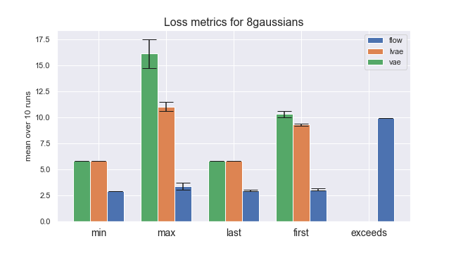
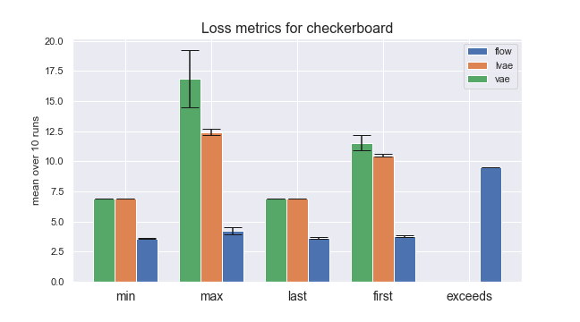

# Investigating Convergence Metrics for Deep Generative Models

Modern Generative Models have achieved impressive results in Computer Vision, Natural Language Processing, and Density Estimation. However such results rely on brittle models that achieve convergence through optimization tricks, heavy hyperparameter optimization, and domain knowledge. In this project, we aim to study and compare the robustness of Deep Latent Variable and Flow Models with a focus on the role of random initialization (seed) on the training dynamics.

The project is carried out by [Simon Amtoft Pedersen](https://github.com/simonamtoft), and supervised by [Giorgio Giannone](https://georgosgeorgos.github.io/) and [Ole Winther](https://orbit.dtu.dk/en/persons/ole-winther).


## Adapting Autoencoders to Two-dimensional Toy Data

In order to train autoencoders such as the standard variational autoencoder (VAE) or a hierarchical autoencoder such as the ladder variational autoencoder (LVAE), the training approach has to be adapted. These models have a generative part given by <!--  -->, where we try to model the original distribution of the data with `p`, such that we can draw samples with <!--   -->
and <!--  -->. This is done by encoding the original data into the latent space, using the distribution `q`, such that reconstructed images can be created by drawing from <!--  -->
.

The training of either of these two models optimize the evidence lower bound (ELBO) <!--  -->, consisting of a reconstruction and a Kullback–Leibler (KL) divergence term. The difference in training on two-dimensional data instead of standard image data like MNIST is the way in which we use the reconstruction term, while the KL term is calculated by learned distributions with: 

<!--   -->

For binarized MNIST data, the reconstruction term is simply the binary cross-entropy loss between the original images and the reconstructed images achieved from a pass through of the model. 

A way to adapt the autoencoder models is to model each dimension of the data with a mean and variance, such that the decoder outputs these <!--  -->
. Then a likelihood distribution is created from this decoder output, <!--  --> from which we compute the log probability of the input two-dimensional data point to originate from such a distribution, which is then our reconstruction term (see [implementation](https://github.com/simonamtoft/generative-convergence/blob/main/trainers_toy/train_vae.py#L69)).


## Convergence Metrics
In order to compare convergence of different models, each model is trained a number of times (e.g. 10), from which metrics on the test losses for each epoch during training can be calculated. For each of these runs, a different random seed is used for all used procedures (see [seed_everything](https://github.com/simonamtoft/generative-convergence/blob/main/lib/random_seed.py)). Then, the min, max and final test loss is taken from each run, along with computing the mean over the first five epochs. This is done for each of the 10 runs of each model on the different datasets, where the mean is taken over the 10 runs which has different random initializations.


### Toy Data
For the toy data, we've chosen to look at the `8gaussians` and `checkerboard` toy data from the FFJORD paper (see [gen_data](https://github.com/simonamtoft/generative-convergence/blob/main/lib/gen_data.py#L18)). For each of the two datasets, a set of Flow, VAE and LVAE models are trained and computed metrics for, as shown on the plots and table below.






|               | model   |   min |   max |   last |   first |   exceeds |
|---------------|:--------|------:|------:|-------:|--------:|----------:|
|  8gaussians   | flow    |  2.91 |  3.36 |   2.95 |    3.06 |       9.9 |
|               | lvae    |  5.82 | 11.04 |   5.82 |    9.29 |       0   |
|               | vae     |  5.82 | 16.11 |   5.82 |   10.3  |       0   |
|  checkerboard | flow    |  3.58 |  4.23 |   3.63 |    3.79 |       9.5 |
|               | lvae    |  6.92 | 12.42 |   6.92 |   10.48 |       0   |
|               | vae     |  6.91 | 16.86 |   6.91 |   11.52 |       0   |

### Binarized MNIST 

Additionally, metrics are computed using the binarized MNIST data, where a set fo DRAW, Flow, VAE and LVAE models are trained and computed metrics for, as shown on the plots and table below.


| model   |    min |           max |   last |   first |   exceeds |
|:--------|-------:|--------------:|-------:|--------:|----------:|
| draw    |  86.33 | 373.11        |  86.52 |  221.09 |       0   |
| flow    | 162.19 | 4.64727e+18   | 176.54 |  267.04 |       2.2 |
| lvae    | 125.87 | 306.51        | 126.11 |  252.48 |       0   |
| vae     | 124.65 | 283.04        | 125.07 |  243.93 |       0.1 |


### DRAW Variations

In addition to the above metrics comparisons, an investegation of the different DRAW features are made. In addition to the DRAW implementation with the base attention module, which has a linear layer for the write operation, three variations are created. 

The equations for the full base attention DRAW implementation is given by:

<!--  -->

<!--  -->


<!--  -->


Refer to the [readme](https://github.com/simonamtoft/recurrence-and-attention-latent-variable-models#deep-recurrent-attentive-writer) of my GitHub repo where I implemented the DRAW model initially, for a more detailed explanation.

#### Draw 2 (without error image)
The first variation is the base attention DRAW implementation, but without computing the error image 

The equations then become:


#### Draw 3 (without canvas updates)
The second variation is the base attention DRAW implementation, but without iteratively updating the canvas over the timesteps , but simply setting the canvas at each time-step to be the output of the decoder (after the write operation). 

The equations then become:


#### Draw 4 (w/o error image and canvas updates)

This variation combines the two previously mentioned variations, such that we have the base attention DRAW implementation, but without both the error image and having a canvas that iteratively updates for each timestep.

The equations then become:


#### Evaluating Performance of Variations
Finally, we evaluate the standard DRAW implementation alongside the three variations just described, according to the same loss metrics as earlier, which results in the followings barplots and metrics table. This is done both for the binarized MNIST and Omniglot datasets, in order to see if some implementation might be better for more advaned datasets. 


|           | model   |    min |    max |   last |   first |   exceeds |
|:----------|:--------|-------:|-------:|-------:|--------:|----------:|
|  omniglot | draw    | 114.75 | 242.02 | 117.42 |  211.93 |         0 |
|           | draw2   | 113.67 | 283.27 | 117.62 |  223.96 |         0 |
|           | draw3   | 109.56 | 213.01 | 114.96 |  180.19 |         0 |
|           | draw4   | 108.32 | 199.68 | 115.28 |  177.38 |         0 |
|  mnist    | draw    |  86.33 | 373.11 |  86.52 |  221.09 |         0 |
|           | draw2   |  86.02 | 328.89 |  86.2  |  207.49 |         0 |
|           | draw3   |  85.85 | 271.92 |  85.99 |  200.6  |         0 |
|           | draw4   |  85.67 | 262.82 |  85.79 |  193.82 |         0 |

Here we see that the resulting validation loss metrics are nearly equal in regards to the min and last loss, but that the full draw version is actually the worst in regards to the initial and maximum loss recorded. This is somewhat counter-intuitive, but might not be true for more complex datasets, or when using the Filterbank attention instead of base.

### Model Parameters

In order to ensure that the comparisons of metrics for different models on the same dataset is somewhat fair, the number of free parameters of each model are computed, such that we see that the best performing models are not best because them just having a larger number of parameters.

| Model	| MNIST	| Toy |
| :-----| ----: |----:|
|flow	|3634680|	82824 |
|lvae	|1464464|	79164 |
|vae	|1162000|	68620 |
|draw	|3262304|	n/a |
|draw2	|2459488|	n/a |
|draw3	|3262304|	n/a |
|draw4	|2459488|	n/a |

From this table we see that e.g. for MNIST, the flow model had the largest number of trainable parameters, but it had the worst performance in regards to the different training metrics, and stability of training (shown with the variance of the bar plot).


## Model Training

Training a model on toy data can be run by simply

```cmd
python train_toy.py -m <model_name> -d <dataset_name> -e <n_epochs> -mute -n <n_seeds>
```

Training a model on MNIST data can be run by simply

```cmd
python train.py -m <model_name> -e <n_epochs> -mute -n <n_seeds>
```


Where

- `model_name` picks the model architecture to train. Can be either of the implemented models: `vae`, `lvae`, `flow` or `draw` (Note: the DRAW model is not implemented for training on the toy data).
- `dataset_name` picks the toy data to train on. Can be either of the datasets from FFJORD.
- `n_epochs` decides the number of epochs to train over.
- `-mute` mutes the output from tqdm, don't use flag if you want the output.
- `n_seeds` decides the number of training runs to do on different seeds. If you just want to train a single model, don't set this flag (default is 1).

Example for no mute train of Ladder VAE on the 8gaussians dataset.

```cmd
python train_toy.py -m lvae -d 8gaussians -e 500
```

The used torch install

```pip3 install torch==1.7.1+cu110 torchvision==0.8.2+cu110 torchaudio==0.7.2 -f https://download.pytorch.org/whl/torch_stable.html```


## References
This project uses model implementations from the following repositories:

- [VAE, LadderVAE, DRAW models](https://github.com/simonamtoft/recurrence-and-attention-latent-variable-models)
- [Flow model](https://github.com/didriknielsen/survae_flows)
- [Toy Data Generation](https://github.com/simonamtoft/tfde-tfp/blob/main/datasets/toy_data.py)

Which originates in the theory from the following papers:

- Diederik P. Kingma & Max Welling: An Introduction to Variational Autoencoders, [arXiv:1906.02691](https://arxiv.org/abs/1906.02691)
- Carl Doersch: Tutorial on Variational Autoencoders, [arXiv:1606.05908](https://arxiv.org/abs/1606.05908)
- Casper Kaae Sønderby, Tapani Raiko, Lars Maaløe, Søren Kaae Sønderby & Ole Winther: Ladder Variational Autoencoders, [arXiv:1602.02282](https://arxiv.org/abs/1602.02282)
- Karol Gregor, Ivo Danihelka, Alex Graves, Danilo Jimenez Rezende & Daan Wierstra: DRAW, A Recurrent Neural Network For Image Generation, [arXiv:1502.04623](https://arxiv.org/abs/1502.04623)
- Will Grathwohl, Ricky T. Q. Chen, Jesse Bettencourt, Ilya Sutskever & David Duvenaud: FFJORD, Free-form Continuous Dynamics for Scalable Reversible Generative Models, [	arXiv:1810.01367](https://arxiv.org/abs/1810.01367)
- Didrik Nielsen, Priyank Jaini, Emiel Hoogeboom, Ole Winther & Max Welling: SurVAE Flows, Surjections to Bridge the Gap between VAEs and Flows, [arXiv:2007.02731](https://arxiv.org/abs/2007.02731)
